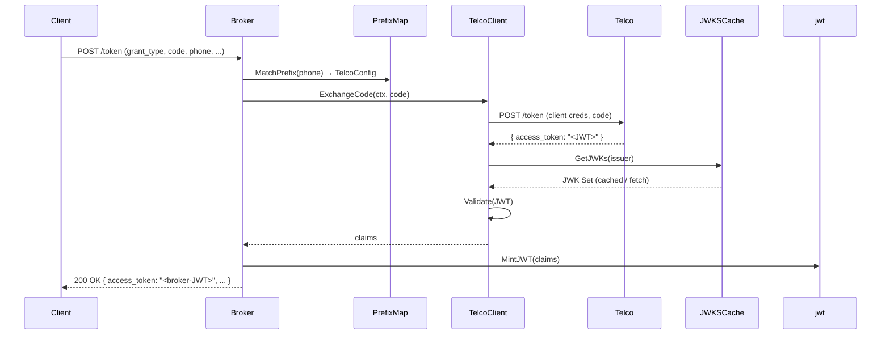

# SIM-Auth-Token-Broker Design Document

## 1. Overview

This document outlines the design for the SIM‑Auth‑Token‑Broker microservice, which:

* Routes incoming `/token` requests by phone-number prefix (MCC+MNC) to the correct Telco service.
* Dynamically loads and secures each Telco’s connection details (base\_url, client\_id, secret).
* Proxies OAuth2/OIDC token requests, validates the upstream JWT, then mints its own JWT (auth\_method="sim").
* Includes performance optimizations, production operational features, and a Cloud Run–ready deployment.

## 2. System Architecture

## 3. Mock Telco Services

* **Endpoints**:

  * `POST /token` ⇒ `{ access_token: "<jwt>", expires_in: 3600 }`
  * `GET /.well-known/jwks.json` ⇒ JWK set
* **Implementation**: Two minimal HTTP servers (Go/Node.js/Python).
* **Purpose**: Simulate real Telco OAuth2/OIDC providers with distinct keys.

## 4. Broker Service

* **API**: `POST /token` with fields:
  * `grant_type`, `code`, `phone` (E.164), optional PKCE (`code_verifier`, `code_challenge`).
* **Responsibilities**:

  1. Validate incoming parameters.
  2. Determine Telco via prefix routing (Section 5).
  3. Load Telco credentials (Section 6).
  4. Forward request to `telco_base_url/token`.
  5. Validate upstream JWT via cached JWKS (Section 7).
  6. Mint broker JWT (Section 8) and return to client.

## 5. Telco Directory & Prefix Routing

* **Source**: `prefix_map.yaml` (provided).
* **Loader**: On startup, read and validate YAML into an in-memory trie or sorted list keyed by numeric prefixes.
* **Longest-Prefix-Match**: When number arrives, pick the entry with the most specific matching prefix.
* **Hot-Reload** (optional): Watch file changes and atomically swap in new map.
* **Error Handling**: Return HTTP 400 if no prefix matches.

## 6. Secrets Management

* **Local Dev**:

  * Use `.env` or env vars (`TELCO_PREFIX_MAP_PATH`, `BROKER_JWT_SECRET`, etc.).
  * Support Docker Compose with mounted secrets.
* **GCP Cloud Run**:

  * Store `prefix_map.yaml` in Cloud Storage or bake into container.
  * Store each Telco’s `client_secret` and the broker’s signing key in Secret Manager.
  * Inject secrets via Cloud Run Secrets to env vars.
* **12‑Factor**: All config via environment; no baked-in secrets.

## 7. JWKS Caching

* **Cache Store**: In-memory per Telco, keyed by issuer URL.
* **TTL**: 10 minutes by default.
* **Refresh Strategy**:

  * Proactively refresh after TTL expires in background.
  * On `kid` mismatch during validation, immediately fetch and update.
* **Library**: Use `go-jose` or `node-jose` for JWK parsing/verification.

## 8. JWT Minting

* **Algorithm**: HS256 (server-managed secret) or ES256 (asymmetric key).
* **Claims**:

  * `sub`, `iss`, `iat`, `exp` (15 min expiry), `auth_method: "sim"`, `telco: <name>`.
* **Key Management**: Signing key in env var or Secret Manager.
* **Library**: `jwt-go` or `jsonwebtoken`.

## 9. Performance & Latency Strategy

* **Target**: p95 ≤ 120 ms at 100 RPS.
* **Assumptions**: Telco adds \~40 ms network + processing.
* **Optimizations**:

  * Keep keep-alive HTTP clients to upstream Telcos.
  * Hot caches for JWKS and prefix map.
  * Pooled goroutines/workers for parallel token requests.
  * Connection pooling and minimal JSON parsing.
* **Metrics**: Expose Prometheus metrics for latency and error rates.

## 10. Deployment

* **Dockerfile**:

  * Multi-stage build: compile binary, then minimal runtime image.
  * Copy `prefix_map.yaml`, configure entrypoint.
* **deploy.sh**:
* **Mock Services**: Optionally containerized and deployed to the same or a separate Cloud Run service.

## 11. Production Operational Features

* **Health Check**: `GET /healthz` returning 200 if dependent caches and config are loaded.
* **Logging**: Structured JSON logs (timestamp, level, request\_id, duration).
* **Graceful Shutdown**: Drain in-flight requests, close HTTP clients.
* **Resilience**:

  * Rate limiter on incoming requests (token bucket).
  * Circuit breaker on Telco calls (fail fast, cooldown).

## 12. Trade‑offs & Alternatives

| Concern            | Choice                      | Trade‑off                                      |
| ------------------ | --------------------------- | ---------------------------------------------- |
| Prefix map storage | In‑memory trie + hot‑reload | Fast lookup; added complexity for hot‑reload   |
| JWT signing        | HS256                       | Simpler key management vs. asymmetric ES256    |
| JWKS TTL           | 10 min                      | Staleness window vs. frequent network calls    |
| Secrets loading    | Env vars + Secret Manager   | 12‑factor compliance vs. external dependencies |
